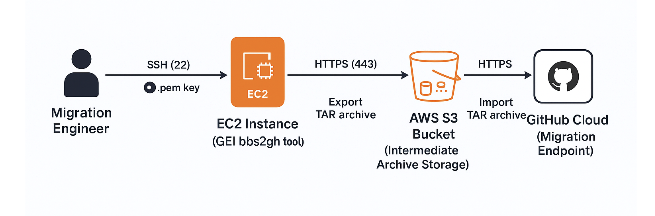

# BitBucket to GitHub Migration

## Prerequisites

### BBS or Jump Server

- SSH access to server or jump host

### Bitbucket

- Bitbucket Admin API access to extract repository metadata (e.g., default branches, permissions, PRs)
- Bitbucket Project/Repository read access to read repository metadata, branches, history, and pull requests

### GitHub

- GitHub Organization Admin permissions needed to create new repositories during migration
- Write access to target repository to import data and history
- Personal Access Token (PAT) to authenticate CLI to GHEC. Must have scopes: `repo`, `admin:org`, and `workflow` if using Actions

## GitHub CLI Installation and Extensions Setup

### User Level Installation

``` bash
mkdir -p ~/bin
cd ~/bin
wget https://github.com/cli/cli/releases/download/v2.50.0/gh_2.50.0_linux_amd64.tar.gz
tar -xzf gh_2.50.0_linux_amd64.tar.gz
mv gh_2.50.0_linux_amd64/bin/gh ~/bin/gh
echo 'export PATH=$HOME/bin:$PATH' >> ~/.bashrc
source ~/.bashrc
gh version
gh auth login
gh extension install github/gh-gei
gh extension install github/gh-bbs2gh

# Get IMDSv2 token (6-hour TTL)
TOKEN=$(curl -X PUT "http://169.254.169.254/latest/api/token" \
  -H "X-aws-ec2-metadata-token-ttl-seconds: 21600")

# Get role name
ROLE_NAME=$(curl -H "X-aws-ec2-metadata-token: $TOKEN" \
  http://169.254.169.254/latest/meta-data/iam/security-credentials/)

# Get credentials JSON
CREDS=$(curl -H "X-aws-ec2-metadata-token: $TOKEN" \
  http://169.254.169.254/latest/meta-data/iam/security-credentials/$ROLE_NAME)

# Extract and export credentials
export AWS_ACCESS_KEY_ID=$(echo $CREDS | jq -r '.AccessKeyId')
export AWS_SECRET_ACCESS_KEY=$(echo $CREDS | jq -r '.SecretAccessKey')
export AWS_SESSION_TOKEN=$(echo $CREDS | jq -r '.Token')
export AWS_REGION=$(curl -H "X-aws-ec2-metadata-token: $TOKEN" \
  http://169.254.169.254/latest/meta-data/placement/region)

export GH_PAT=<PAT>
export BBS_USERNAME=<BBS_Username>
export BBS_PASSWORD=<BBS_PASS>
```

## Pre-Migration

### Inventory Collection

- **Pull Inventory Project Level** - `inventory_bbs_project_list.py`

```bash
python .\inventory_bbs_project_list.py --bitbucket_url "BBS_URL" --username "USERNAME" --password $BBS_PASS --output "bbs_testproj.xlsx"
```

- **Pull Inventory Repository Level** - `inventory_bbs_all_repo_list.py` (Requires .xlsx file with project lists generated from above script)

```bash
# Below command runs the script in background
Start-Process python -ArgumentList ".\inventory_bbs_all_repo_list.py", "--bitbucket_url", "BBS_URL", "--username", "USERNAME", "--password", $BBS_PASS -NoNewWindow -RedirectStandardOutput "output.log" -RedirectStandardError "output_err.log"
```

- **Pull Inventory Pre/Post Migration** - `inventory_bbs_given_repos.py` (Requires .xlsx file with projects and repositories listed)

```bash
# Below command runs the script in background
Start-Process python -ArgumentList ".\inventory_bbs_given_repos.py", "--bitbucket_url", "BBS_URL", "--username", "USERNAME", "--password", $BBS_PASS -NoNewWindow -RedirectStandardOutput "output.log" -RedirectStandardError "output_err.log"
```

- **Pull Inventory from GitHub for Validation** - `inventory_gh_given_repo.py`
- **Note**: Wait 24-48 hours - GitHub sometimes takes time to update repository statistics after BBS migrations.

```bash
python .\inventory_gh_given_repo.py --source_org "TARGET_GH_ORG" --output_file "GH-Repo-Inventory-Repo-post.xlsx"
```

### Dry Run
- Run the migrate-repo command on few repos provided by customer to validate migration is successfull without any issues
- Any issues faced on dry run can be fixed and migration will be smooth

```bash
# single repo migration
# Migration based of TAR located at shared drive /var/atlassian/application-data/bitbucket/shared/data/migration/export/".tar"
# adjust the command based on the tar file location
gh bbs2gh migrate-repo \
  --aws-bucket-name **S3_bucket_name** \
  --bbs-server-url **BBS_URL** \
  --bbs-project **BBS_Project** \
  --bbs-repo **BBS_Repo_Name** \
  --github-org **Target_GH_ORG** \
  --github-repo **Target_GH_Repo_Name** \
  --target-repo-visibility private
```


## Migration
- Below command will generate powershell script with all the gh commands with source and targets 
```bash
gh bbs2gh generate-script --bbs-server-url BBS_URL --github-org ORG --output migrate.ps1 --no-ssl-verify
```

## Issues Experienced

- **[ERROR] Git source migration failed. Error message: An error occurred. Please contact support for further assistance.**
  - **FIX**: Ruleset blocking pushing of tags. Deactivate ruleset, since we cannot add the ghost user to bypassers

- **Repository rule violations**
  - **FIX**: Deactivate ruleset
